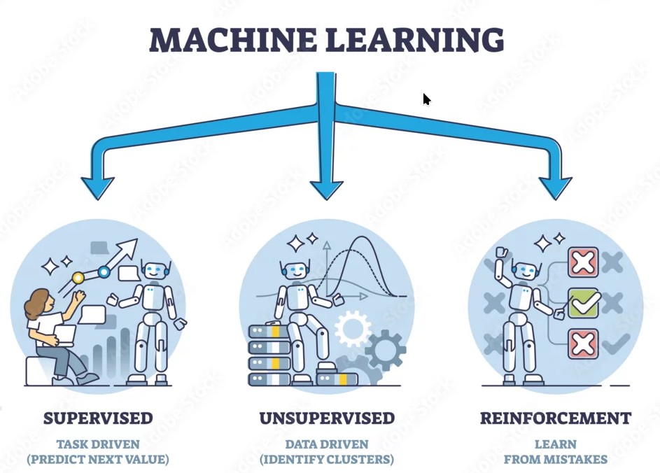

# Machine Learning Zoomcamp 2025 - Homework
Homework repository for [Machine Learning Zoomcamp](https://github.com/rosa-lpz/machine-learning-zoomcamp-2025) by [DataTalksClub](https://github.com/DataTalksClub)

## Content

### [Module 1: Introduction to Machine Learning](01-intro/)

Learn the fundamentals: what ML is, when to use it, and how to approach ML problems using the CRISP-DM framework.

**Topics:**
- ML vs rule-based systems
- Supervised learning basics
- CRISP-DM methodology
- Model selection concepts
- Environment setup

### [Module 2: Machine Learning for Regression](02-regression/)

Build a car price prediction model while learning linear regression, feature engineering, and regularization.

**Topics:**
- Linear regression (from scratch and with scikit-learn)
- Exploratory data analysis
- Feature engineering
- Regularization techniques
- Model validation

### [Module 3: Machine Learning for Classification](03-classification/)

Create a customer churn prediction system using logistic regression and learn about feature selection.

**Topics:**
- Logistic regression
- Feature importance and selection
- Categorical variable encoding
- Model interpretation

### [Module 4: Evaluation Metrics for Classification](04-evaluation/)

Learn how to properly evaluate classification models and handle imbalanced datasets.

**Topics:**
- Accuracy, precision, recall, F1-score
- ROC curves and AUC
- Cross-validation
- Confusion matrices
- Class imbalance handling

### [Module 5: Deploying Machine Learning Models](05-deployment/)

Turn your models into web services and deploy them with Docker and cloud platforms.

**Topics:**
- Model serialization with Pickle
- FastAPI web services
- Docker containerization
- Cloud deployment

### [Module 6: Decision Trees & Ensemble Learning](06-trees/)

Learn tree-based models and ensemble methods for better predictions.

**Topics:**
- Decision trees
- Random Forest
- Gradient boosting (XGBoost)
- Hyperparameter tuning
- Feature importance

### Midterm Project

Apply everything you've learned in a complete project: find a dataset, train models, and deploy a web service.

### [Module 7: Neural Networks & Deep Learning](08-deep-learning/)

Introduction to neural networks using TensorFlow and Keras, including CNNs and transfer learning.

**Topics:**
- Neural network fundamentals
- PyTorch
- TensorFlow & Keras
- Convolutional Neural Networks
- Transfer learning
- Model optimization

### [Module 8: Serverless Deep Learning](09-serverless/)

Deploy deep learning models using serverless technologies like AWS Lambda.

**Topics:**
- Serverless concepts
- Deploying Scikit-Learn models with AWS Lambda
- Deploying TensorFlow and PyTorch models with AWS Lambda
- API Gateway

### [Module 9: Kubernetes & TensorFlow Serving](10-kubernetes/)

Learn to serve ML models at scale using Kubernetes and TensorFlow Serving.

**Topics:**
- Kubernetes basics
- TensorFlow Serving
- Model deployment and scaling
- Load balancing
  

## About DataTalks.Club

  

<a href="https://datatalks.club/">DataTalks.Club</a> is a global online community of data enthusiasts. It's a place to discuss data, learn, share knowledge, ask and answer questions, and support each other.

